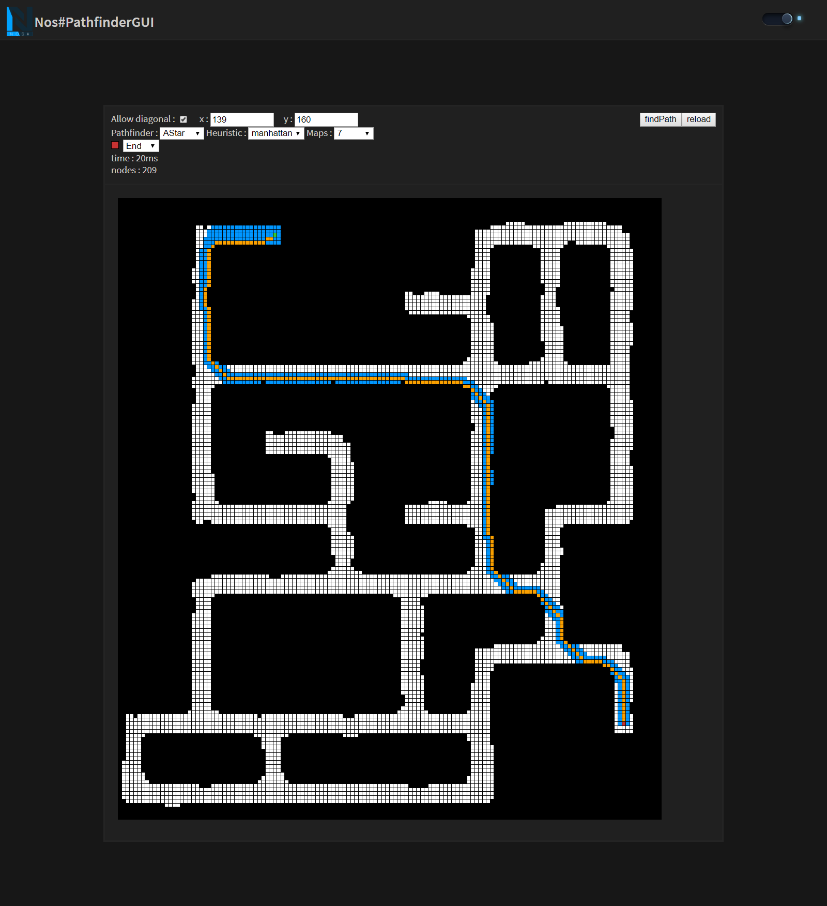
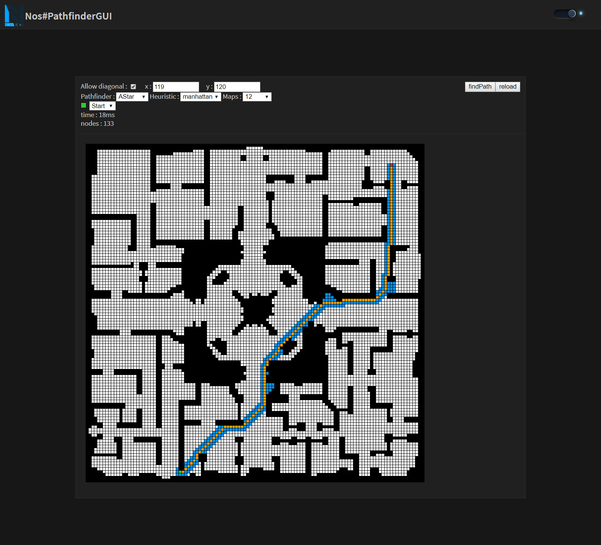

# NosSharpPathfinderGUI

</img>
</img>

[](https://forthebadge.com)

## Description

NosSharpPathfinderGUI is a graphical interface made with VueJS that allows you to test different pathfinder algorithms on nostale maps

## Build Setup

``` bash
# install dependencies
npm install

# serve with hot reload at localhost:8080
npm run dev

# build for production with minification
npm run build
```